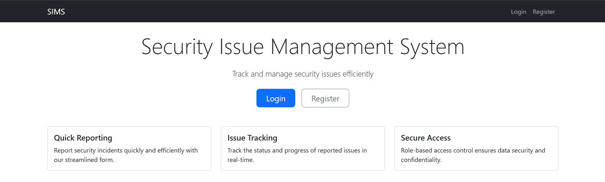
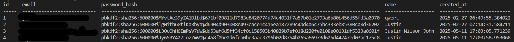
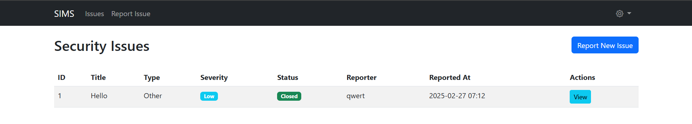
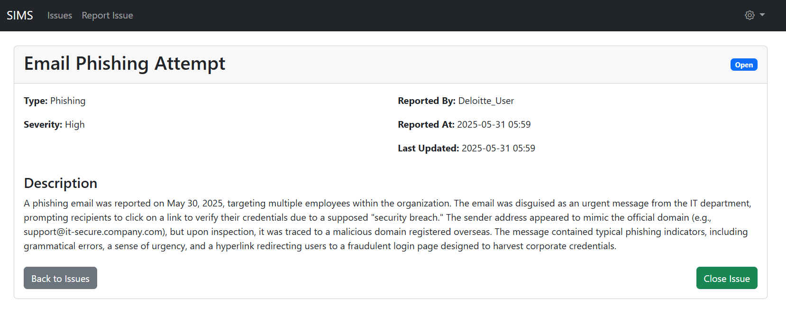
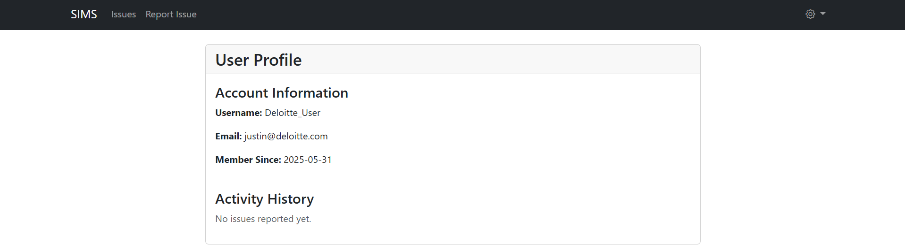

# Security Issue Management System

A web application for tracking and managing security issues efficiently. Built with Flask, SQLAlchemy, and Bootstrap.

## Features

- User authentication (login, registration, logout)
- Report new security issues
- View, close, and reopen issues
- User profile with activity history
- API endpoints for testing database connection and retrieving entries

## Tech Stack

- **Backend**: Flask, Flask-SQLAlchemy, Flask-Login, Flask-Migrate, Flask-WTF
- **Database**: SQLite
- **Frontend**: Bootstrap, Jinja2
- **Other**: Email-validator, python-dotenv

## Installation

1. **Clone the repository**:

   ```sh
   git clone https://github.com/codecat1111/bug-tracking-system.git
   cd bug-tracking-system
   ```

2. **Set up the virtual environment**:

   ```sh
   python -m venv venv
   ```

   For Command Prompt:

   ```sh
   venv\Scripts\activate.bat
   ```

   For PowerShell:

   ```sh
   .\venv\Scripts\Activate.ps1
   ```

3. **Install dependencies**:

   ```sh
   pip install -r requirements.txt
   ```

4. **Set up the database**:

   ```sh
   python init_db.py
   ```

5. **Run the application**:

   ```sh
   flask run
   ```

   The application will be available at `http://127.0.0.1:5000/`.

## Usage

- **Home Page**: View the home page with options to login or register.
  
  
- **Login**: Access the login page to authenticate. Implemented Hashing as additional security measure using the `werkzeug.security` module.
  
  
- **Register**: Access the registration page to create a new account.
- **Report Issue**: Authenticated users can report new security issues.
- **View Issues**: View a list of all reported issues.
  
   
- **View Issue**: View detailed information about a specific issue.

   
  
- **Profile**: View user profile and activity history.

   

## API Endpoints

- **Test Connection**: `/api/test` (POST) - Test database connection.
- **Get Entries**: `/api/entries` (GET) - Retrieve recent entries.

## File Structure

- app.py: Main application file.
- config.py: Configuration file for Flask and SQLAlchemy.
- models.py: Database models for User and Issue.
- init_db.py: Script to initialize the database.
- requirements.txt: List of dependencies.
- templates: Directory containing HTML templates.
- `static/`: Directory for static files (CSS, JS).

## License

This project is licensed under the MIT License.


## ⭐ Found It Helpful? [Star It!](https://github.com/codecat1111/bug-tracking-system/stargazers)

If you found this project helpful, let the community know by giving it a [star](https://github.com/codecat1111/bug-tracking-system/stargazers): [👉⭐](https://github.com/codecat1111/bug-tracking-system/stargazers)

---

For inquiries, feature requests, or to report issues, please utilize the GitHub issue tracking system or contribute via pull requests.

